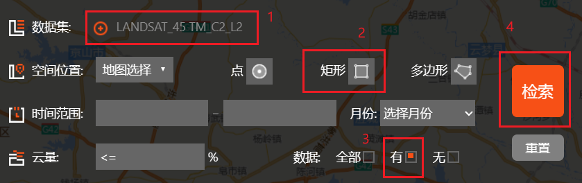
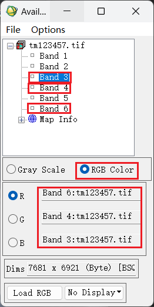

# 模式识别

## 代码文件
|文件|简介|
|--|--|
|whu.tif|含6个波段的tif图像|
|whu_roi.txt|兴趣点文件|
|whu.mat|处理过后的兴趣点二进制文件|
|ReadData.m|预处理whu_roi.txt文件|
|Mahalanobis.m|马氏距离分类器|
|Kmeans.m|K均值聚类|
|FuzzyKmeans.m|模糊K均值聚类|
|ISODATA.m|IOSDATA算法|

## TM影像下载与处理

### 1. 下载TM遥感影像

在```地理空间数据云```（网站链接在文末）

网站中进入高级检索，选择数据集和区域，进行检索。



选择下载影像，页面地图上可以显示选择的影像的区域。

*修正：数据集选择 ```Landsat4-5 TM 卫星数字产品```*


下载TM遥感影像，解压后的完整文件目录如下所示。


### 2. 图像预处理

TM影像包含7个波段（具体介绍见文末链接）。实习要求使用1，2，3，4，5，7这六个波段，需要将这六个波段输出为一个```.tif```文件。在```ENVI```软件中完成。首先在```ENVI```中以正确的格式打开下载的遥感影像数据。


软件会自动筛选```*_mtl.txt```文件，选择影像文件夹中对应的文件。


在弹出的页面选择要进行假彩色增强的三个波段，选择7，4，3三个波段作为RGB数据来源，按照这个规则合成的影像色调接近自然彩色，便于选择训练样本。选择完成点击加载。


加载后的图像如下所示。


将实习中的要求的六个波段导出为一个tif文件。


选择要导出的输入文件，这里```ENVI```自动将1，2，3，4，5，7波段划分为一个集合（可能是第6个波段有什么特殊之处），所以直接选择以```MultiSpectral```结尾的集合。直接下载的图像太大，可以通过```空间裁剪```进行剪切。（1024*1024）


在弹出的窗口中选择输出格式为```TIFF```，输出文件名要写完整，写自己想要输出的路径及文件名。


输出的文件如下所示，这个文件含有六个波段，无法通过一般图片浏览器打开。


使用```ENVI Classic```工具（注意不是```ENVI```主程序，这是一个随```ENVI```一起安装的程序，使用搜索可以搜到）。


打开导出的```tif```文件。


在弹出的窗口选择要假彩色增强的波段（仅用于展示），选择6，4，3波段，对应之前的7，4，3波段。点击```Load RGB```



### 3. 选择训练样本

选择训练样本的操作见老师发的视频。

### 4. MATLAB读取ENVI导出的roi.txt文件


## 相关链接
- [TM图像](https://baike.baidu.com/item/TM%E5%BD%B1%E5%83%8F/9945494)
- [TM影像各波段介绍](https://blog.csdn.net/ctyqy2015301200079/article/details/84329692)
- [地理空间数据云](https://www.gscloud.cn/)